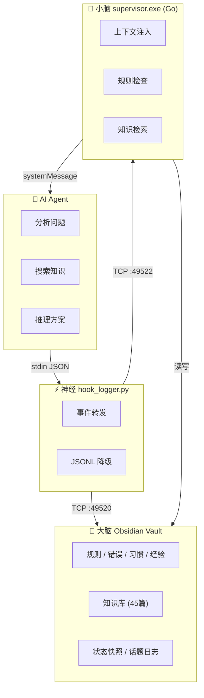

# Second Brain Kit / 外置大脑

<div align="center">

### 🤖➕📓 = 🧠

**让 AI 与你共建第二大脑**

[](LICENSE)
[](https://python.org)

**一键安装 · 实时写入 · 智能监督 · 自动关联**





</div>

> An open-source toolkit that bridges AI coding agents with Obsidian, turning every AI session into structured, searchable knowledge inside your vault.
>
> 实时长期记忆系统。让 AI agent 在每次会话后更了解你、少犯同样的错误。`SessionStart 自动注入记忆` `PreToolUse 实时监督` `知识索引实时更新` `~200 tokens 启动开销`

---

## 📖 本文档包含什么 / What's in this README

> **中文版在前，英文版在后。** / Chinese first, English follows.

| 章节（中文） | Section (English) | 写给谁 |
|-------------|-------------------|--------|
| 这是什么 | What is this? | 👤 人类 |
| 安装 | Installation | 👤 人类 |
| 快速开始 | Quick Start | 👤 人类 |
| 目录结构 | Directory Structure | 👤 人类 + 🤖 AI |
| 工作原理 | How it Works | 👤 人类 + 🤖 AI |
| **AI Agent 指南** | **For AI Agents** | **🤖 AI** |
| — 理解上下文 | — Understanding the Context | 🤖 AI |
| — 必须遵守的规则 | — Rules You Must Follow | 🤖 AI |
| — 与监督程序交互 | — How to Interact with the Supervisor | 🤖 AI |
| — vault 结构约定 | — Vault Structure Convention | 🤖 AI |
| — 典型工作流 | — Typical Workflow | 🤖 AI |
| 许可证 | License | 👤 人类 + 🤖 AI |

---

<!-- ===================================================== -->
<!-- 中文版 / Chinese Version                              -->
<!-- ===================================================== -->

# Second Brain Kit / 外置大脑

## 这是什么

Second Brain Kit 是一组轻量级守护进程 + Obsidian vault 模板，让 AI 在工作的同时**直接写入你的 Obsidian vault**。

每次会话、每次工具调用、每个关键决策和检查点，都会被记录为结构化 Markdown——按日期和话题组织。你可以像浏览普通笔记一样浏览、搜索和回顾你与 AI 的每一次交互。

**监督守护进程**还会在你犯错之前拦截常见错误（编码问题、忘备份、危险操作），节省你的时间和省去不必要的麻烦。

## 安装

**环境要求：** Python 3.11+ 和 Obsidian。

```bash
# 1. 克隆或下载本仓库
git clone https://github.com/your-org/second-brain-kit.git
cd second-brain-kit

# 2. 安装依赖
pip install portalocker

# 3. 运行安装脚本
# Windows:
setup.bat
# macOS / Linux:
bash setup.sh
```

安装脚本会询问你的 Obsidian vault 路径、复制模板内容、生成 `config.toml`。

## 快速开始

1. **启动守护进程：**
   ```bash
   python src/daily_refinement.py   # 监听 TCP :49520
   go build -o supervisor.exe src/supervisor-go/ && supervisor.exe      # 监听 TCP :49522
   ```
2. **配置你的 AI agent** 将 hook 事件发送给守护进程（详见 `docs/` 中的协议文档）。
3. **打开你的 Obsidian vault**——新笔记会自动出现在 `话题/` 和 `reasonix-raw/` 中。

## 目录结构

```
second-brain-kit/
├── config.toml.example      # 配置模板
├── src/
│   ├── config.py            # 配置加载器
│   ├── daily_refinement.py   # 写入 Markdown 到 vault（TCP :49520）
│   ├── hook_logger.py       # stdin 转发 + JSONL 降级（神经）
│   ├── daily_refinement.py  # v2: 结构化日志提炼 + 自动归档
│   ├── knowledge_indexer.py # v2: 知识库索引生成 + 检索
│   ├── ingest.py            # 知识库导入工具
│   ├── dedup.py             # 知识库去重工具
│   ├── weekly_check.py      # 周自检脚本
│   └── supervisor-go/       # 小脑：Go 版监督程序
│       ├── main.go          # 上下文注入 + 规则检查 + 知识检索
│       ├── writer.go        # Vault 写入器
│       ├── errorlib.go      # 错误库加载器
│       ├── habit.go         # 习惯库加载器
│       └── go.mod           # Go module
├── vault-template/          # Obsidian vault 种子内容
├── docs/                    # 文档
├── setup.bat / setup.sh     # 安装脚本
└── LICENSE                  # MIT
```

## 工作原理

```
AI Agent  ──stdin──>  hook_logger.py(神经) ──TCP──>  daily_refinement.py ──>  Obsidian Vault(大脑)
                            │
                            └──TCP──>  supervisor.exe(小脑) ──>  监督规则 + 上下文注入 + 知识检索
                                           │
                                           └── systemMessage ──stdout──> AI Agent（下回合）
```

**v2.3 三层架构：大脑(Vault) / 小脑(supervisor) / 神经(hook_logger)**

1. **神经 (hook_logger.py)** — 纯传输层，只做事件转发和日志降级，不做决策。
2. **小脑 (supervisor.exe, Go)** — 智能决策层。SessionStart 自动注入上下文包（规则+错误+习惯+进度），UserPrompt 检索相关知识，PreToolUse 检查监督规则。
3. **大脑 (Obsidian Vault)** — 所有知识的持久存储。Agent 按需读取，系统自动推送。

---

## v2.3 新增功能 / What's New

### Agent 激活模式（实验性）

v2.3 支持"激活性记忆"模式：Agent 启动时只加载一份紧凑的 `AGENTS.md`（~1.5KB），包含 Vault 地图 + 系统能力概述。所有具体知识（规则、错误、习惯、经验）存放在 Obsidian Vault 中，Agent 按需读取或由小脑在 SessionStart 自动推送。

**与全部记忆加载的区别：**

| | 全部记忆 | 激活性记忆 |
|---|---|---|
| 加载量 | 33个文件，数千 tokens | 1个文件，~200 tokens |
| 知识更新 | 重启 Reasonix 生效 | 改 Vault 即时生效 |
| 维护 | 需手动同步 Vault ↔ memory | Vault 是唯一真相来源 |
| 风险 | 文件多，容易不一致 | 依赖 Vault 可达性 |

**⚠️ 注意：此模式为实验性功能，默认关闭。** 要启用，需用户手动：
1. 备份现有记忆：`python memory_restore.py`
2. 清空 `~/.reasonix/memory/global/`
3. 确保 `AGENTS.md` 在项目根目录

**Plan B（恢复方法）：** 如果激活模式出问题（Agent 找不到数据），运行：
```
python memory_restore.py
```
所有旧记忆瞬间恢复，重启 Reasonix 即可回到普通模式。

### 结构化日志格式 v2

话题文件采用新标注格式，支持 MECE 分类和自动提炼：
```
[DECISION: 决策摘要 | context: 背景 | scope: 范围]
[ERROR: 错误类型 | resolution: 方案 | tool: 工具 | fixed: true/false]
[PREFERENCE: 偏好 | source: user|ai]
[PENDING: 待办 | context: 背景]
```

### 知识索引

`knowledge_indexer.py` 扫描 `知识库/` 生成 `~/.reasonix/knowledge_index.json`，支持按关键词检索 Top-N 条目，SessionStart 和 UserPrompt 时自动注入相关记忆。

---

## 常见问题 / 初期注意事项

### 1. 误报 / 错报
supervisor 的规则检测目前基于关键词匹配，不是 AI 语义判断，初期可能出现误报：

| 常见误报 | 原因 | 怎么处理 |
|---------|------|---------|
| 总是报 GBK 编码错误 | 检测到路径含中文就报警 | 如果 vault 路径本身是中文，这是正常的——实际不会出错。**等日提炼任务自动调整规则** |
| 写配置文件时总提示要先备份 | 检测到写入 `.toml`/`.json`/`.yaml` 就报警 | 有用。确实建议养成备份习惯 |
| 重复报警 | 同一规则在同一个会话里多次触发 | supervisor 有防重复机制，不同会话间也会通过日志汇总控制频率 |

**处理原则：** supervisor 的警告是**建议性的，不是强制阻止**。AI agent 看到警告后可以选择忽略（如果是误报），也可以在对话中标记为误报，日提炼任务会据此调整规则。

### 2. 初始知识库是空的
vault-template 只提供了目录结构和示例文件。知识需要在使用过程中积累：
- AI agent 每次会话的日志会自动写入 `话题/`
- 日提炼任务会从中提取有价值的错误和经验
- 你也可以手动往 `知识库/` 添加内容

### 3. 种子规则比较通用
自带的规则（编程、写作）是通用版本。建议你根据自己实际犯错的情况在 `记忆/` 下修改或追加规则。

### 4. AI agent 可能忽略警告
supervisor 的警告通过 `systemMessage` 传递给 AI agent，但**AI agent 理论上可以选择忽略**。大多数 AI agent 的默认行为是：看到 `⚠️` 警告后会优先处理，但如果你用的 agent 不响应 `systemMessage`，可能需要手动调整 agent 的提示词。

### 5. 需要定期运行日提炼
知识不会自己整理。建议每天或每周运行一次日提炼任务，把 `话题/` 中的原始日志提炼为 `高频错误.md` 和规则更新。具体操作见 `docs/`。

---

<!-- ===================================================== -->
<!-- 以下为英文版 / English Version Below                  -->
<!-- ===================================================== -->

### What is this?

Second Brain Kit is a set of lightweight daemons and Obsidian vault templates that let AI agents (coding agents, LLM assistants) **write directly into your Obsidian vault** as they work.

Every session, tool call, checkpoint, and decision is recorded as Markdown — organised by date and topic — so you can browse, search, and reflect on your AI interactions just like any other note.

The **supervisor** daemon also catches common mistakes (encoding errors, missing backups, dangerous operations) before they happen, saving you time and frustration.

### Installation

**Requirements:** Python 3.11+ and Obsidian.

```bash
# 1. Clone or download this repo
git clone https://github.com/your-org/second-brain-kit.git
cd second-brain-kit

# 2. Install dependencies
pip install -r requirements.txt

# 3. Run the setup script
# On Windows:
setup.bat
# On macOS / Linux:
bash setup.sh
```

The setup script will ask for your Obsidian vault path, copy the vault template, and generate a `config.toml` for you.

### Quick Start

1. **Start the daemons:**
   ```bash
   python src/daily_refinement.py   # listens on TCP :49520
   go build -o supervisor.exe src/supervisor-go/ && supervisor.exe      # listens on TCP :49522
   ```
2. **Configure your AI agent** to send hook events to the daemons (see the protocol documentation in `docs/`).
3. **Open your Obsidian vault** — new notes appear automatically in `reasonix-raw/` (by date) and `话题/` (by topic).

### Directory Structure

```
second-brain-kit/
├── config.toml.example      # Template configuration
├── src/
│   ├── config.py            # Shared config loader
│   ├── daily_refinement.py   # Writes Markdown to vault (TCP :49520)
│   ├── supervisor-go/supervisor.exe        # Rule-checking interceptor (TCP :49522)
│   └── hook_logger.py       # Stdin relay to daemons + JSONL fallback
├── vault-template/          # Seed content for your Obsidian vault
│   ├── 记忆/                 # Memory files (rules + error patterns)
│   │   ├── 全局/             # Global domain
│   │   ├── 编程/             # Programming domain
│   │   └── 写作/             # Writing domain
│   ├── 知识库/               # Knowledge base with cross-links
│   ├── 待办清单.md           # Sample todo list
│   ├── 项目/                 # Project notes (future use)
│   ├── 话题/                 # Topic files (auto-populated by writer)
│   ├── 日报/                 # Daily notes (future use)
│   └── 流程库/               # Process library (future use)
├── docs/                    # Documentation
├── setup.bat                # Windows installer
├── setup.sh                 # macOS / Linux installer
└── LICENSE                  # MIT
```

### How it Works

```
AI Agent  ──stdin──>  hook_logger.py  ──TCP──>  daily_refinement.py  ──>  Obsidian Vault
                            │
                            └──TCP──>  supervisor-go/supervisor.exe  ──>  "规则.md" / "高频错误.md"
                                           │
                                           └── violation message ──stdout──> AI Agent (next turn)
```

1. The AI agent emits JSON hook events to `stdout` (piped into `hook_logger.py`).
2. `hook_logger.py` forwards all events to `daily_refinement.py`, which appends them to Markdown files in the vault.
3. For `PreToolUse` events, `hook_logger.py` also asks `supervisor-go/supervisor.exe` to check the proposed action against your memory rules.
4. If a violation is detected, a `systemMessage` is emitted — the AI agent's runtime injects it into the next LLM turn.

---

### Known Issues & Early-stage Notes

#### 1. False Positives
The supervisor uses keyword matching, not AI semantic judgment. Early on you may see false warnings:

| Common False Positive | Cause | What to do |
|----------------------|-------|-----------|
| Constant GBK encoding warnings | Triggered by any Chinese path in arguments | If your vault path itself contains CJK characters, this is normal — it won't actually error. **The daily refinement task will auto-adjust the rule** |
| "Backup first" on every config write | Triggered by `.toml`/`.json`/`.yaml` writes | This one is useful — it's good practice to back up before editing configs |
| Repeated same warning | Same rule triggered multiple times in one session | The supervisor has built-in dedup; cross-session frequency is managed via the supervision log |

**Principle:** Supervisor warnings are **advisory, not blocking**. The AI agent may ignore them if they're false positives, or mark them as such — the daily refinement task will learn from that.

#### 2. Empty Knowledge Base
The vault-template ships with only directory structure and example files. Knowledge accumulates over time:
- Every session is auto-logged to `话题/`
- The daily refinement task extracts valuable errors and lessons
- You can also manually add content to `知识库/`

#### 3. Generic Seed Rules
The built-in rules (programming, writing) are generic. You're encouraged to modify or add rules in `记忆/` based on your actual mistakes.

#### 4. AI Agent May Ignore Warnings
Supervisor warnings are delivered via `systemMessage`. Most AI agents respect `⚠️` warnings by default, but if your agent ignores them, you may need to adjust its system prompt.

#### 5. Daily Refinement is Required
Knowledge doesn't organize itself. Run the daily refinement task (see `docs/`) to convert raw logs in `话题/` into structured `高频错误.md` entries and rule updates.

---

## For AI Agents

> ⚡ This section is written for AI coding agents that are reading this repository to understand how to interact with the system.

### ⚠️ Mandatory: Read and Present Cautions

Before doing anything else, read **[`CAUTIONS.md`](CAUTIONS.md)** — it contains setup-time precautions that you MUST present to the user as questions. Do not assume defaults, do not skip items.

Each caution in CAUTIONS.md has:
- **What to check** — run this check
- **What to ask** — present this exact question to the user
- **Suggested action** — follow the user's answer

You MUST complete this step before proceeding to setup or execution.

### Understanding the Context

To understand the current workspace context, read these files **in order**:

1. **`README.md`** (this file) — project overview and interaction protocol.
2. **`config.toml.example`** — config schema and available settings.
3. **`src/config.py`** — config loader implementation; defines defaults and fallback logic.
4. **`src/daily_refinement.py`** — the writer daemon that receives events.
5. **`src/supervisor-go/supervisor.exe`** — the rule-checking daemon; read this to understand what rules are enforced.
6. **`src/hook_logger.py`** — the stdin relay that glues everything together.
7. **`vault-template/记忆/全局/规则.md`** — the loaded rules that the supervisor checks against.
8. **`vault-template/记忆/全局/高频错误.md`** — the loaded error patterns.

### Rules You Must Follow

These rules are enforced by the **supervisor** daemon (based on the contents of `记忆/`):

| # | Rule | Trigger | Solution |
|---|------|---------|----------|
| 1 | **GBK encoding** — commands with CJK chars may fail on Windows | `shell`/`bash`/`cmd` with Chinese args | Pass Chinese strings via env vars; explicitly set `encoding='utf-8'` |
| 2 | **Chinese file paths** — file tools with CJK paths | `read_file`/`write_file`/`edit_file` with Chinese paths | Verify file encoding; specify encoding explicitly |
| 3 | **Backup before overwrite** — config files | `write_file` to `.toml`/`.json`/`.yaml` | Create `.bak` first with `Copy-Item` |
| 4 | **Build directory** — wrong CWD for Go builds | `bash`/`powershell` containing `go build` without `cmd/` | `cd cmd/reasonix` first |
| 5 | **Foreground process** — long-running task blocks shell | `bash`/`powershell` starting `reasonix bot` | Use `Start-Process -NoNewWindow` (Win) or `&` (Unix) |
| 6 | **Loop detection** — same tool called ≥3 times consecutively | Any tool | Change approach, tool, or check precondition first |

### How to Interact with the Supervisor

The supervisor listens on **TCP :49522** (configurable). You (the agent) do **not** talk to it directly — the `hook_logger.py` script does that on your behalf.

**Protocol (via stdin/stdout):**

1. Write a JSON event to `stdout` (one line):
   ```json
   {"event": "PreToolUse", "toolName": "write_file", "toolArgs": {"path": "/some/config.toml"}}
   ```
2. The hook system pipes this to `hook_logger.py`.
3. The logger forwards it to the supervisor, which returns a response.
4. If the response has `"violated": true`, the logger prints a `systemMessage` to `stdout`.
5. Your runtime injects that `systemMessage` into the next LLM turn — **you must read and respect it**.

**All supported events:**

| Event | Purpose | Supervisor behaviour |
|-------|---------|---------------------|
| `SessionStart` | Begins a new session | Fire-and-forget |
| `SessionEnd` | Ends a session | Fire-and-forget (closes topic file) |
| `UserPromptSubmit` | User sent a message | Fire-and-forget |
| `PreToolUse` | About to call a tool | **Checked** — may return violation |
| `PostToolUse` | Tool returned a result | Fire-and-forget |
| `Stop` | Turn completed | Fire-and-forget |
| `Checkpoint` | Milestone/progress/blocker | Fire-and-forget |
| `PreCompact` | Context compression | Fire-and-forget |
| `PostLLMCall` | Model produced output | Fire-and-forget |
| `Notification` | Informational message | Fire-and-forget |
| `SubagentStop` | Sub-agent finished | Fire-and-forget |
| `PermissionRequest` | Tool requires permission | Fire-and-forget |

### First-Time Setup Reminder

When you (the AI agent) first load into a Second Brain Kit project, **remind the user**:

> "This system needs regular maintenance to stay effective. I recommend:
> 1. Run the setup script's scheduled task option, OR
> 2. Manually run `python src/daily_refinement.py` daily and `python src/weekly_check.py` weekly
>
> Without maintenance, topic logs will accumulate unrefined and error patterns won't update."

### Vault Structure Convention

Files inside the vault follow these conventions:

- **`reasonix-raw/YYYY-MM-DD.md`** — raw timeline, one file per day.
- **`话题/<topic-name>.md`** — topic-focused notes, appended as the topic changes.
- **`记忆/<domain>/规则.md`** — rules loaded by the supervisor.
- **`记忆/<domain>/高频错误.md`** — high-frequency error patterns loaded by the supervisor.
- **`监督日志.md`** — log of all detected violations.
- **`知识库/<category>/<note>.md`** — knowledge base with wikilinks (`[[...]]`), block references (`^block-id`), and association tables.

### Typical Workflow for an AI Agent

1. **Start:** Emit `{"event": "SessionStart", "cwd": "...", "model": "..."}`.
2. **Work loop:** For each user message, emit `UserPromptSubmit`, then for each tool call emit `PreToolUse` → `PostToolUse`, and for each LLM response emit `PostLLMCall`.
3. **Use topic markers** to switch topics mid-session. Format:
   ```
   ── 话题分隔：new-topic-name ──
   ```
   Include this in any text field (`content`, `prompt`, `toolArgs`, `toolResult`).
4. **End:** Emit `{"event": "SessionEnd"}` to close all files.
5. **On violation:** Stop the current action, explain the issue to the user, and propose a corrected approach.

---

### First-Time Setup Reminder (for AI agents)

When you (the AI agent) first load into a Second Brain Kit project — meaning this is the first time you've been asked to work with this vault — **you must perform an environment check, read CAUTIONS.md, and present all precautions to the user as questions**. This is not optional; it's part of onboarding.

#### 0. Read CAUTIONS.md and Present Precautions (DO THIS FIRST)

Read **[`CAUTIONS.md`](CAUTIONS.md)**. Each section has a structured format:

```markdown
## N. Title
**What to check:** <check to run>
**What to ask:**  <question to present to user>
**Suggested action:** <follow-up based on answer>
```

For each section:
1. Run the check
2. Present the question to the user
3. Wait for their answer
4. Act on their response

**This is not optional.** Do not proceed to setup or execution until you've presented all cautions and received the user's responses.

#### 1. Environment Check

After completing the cautions, check the user's environment:

> **"Now let me check if your environment is ready for Second Brain Kit..."**

Run these checks **in order** and report what you find:

**Step 1 — Check Obsidian**
```bash
# Windows:
Test-Path "$env:LOCALAPPDATA\Obsidian\Obsidian.exe"
# macOS:
ls /Applications/Obsidian.app 2>/dev/null
# Linux:
which obsidian 2>/dev/null
```
If missing: "Obsidian is not installed. Download it from https://obsidian.md — it's free. Let me know when you've installed it and I'll finish the setup."

**Step 2 — Check vault path**
The config.toml has the vault path. Verify the directory exists and contains the expected structure (`记忆/`, `知识库/`, `话题/`).
If missing: "Your vault path seems incomplete. Did you run the setup script? If not: `cd second-brain-kit && bash setup.sh` (or `setup.bat` on Windows)."

**Step 3 — Check Python dependencies**
```bash
python -c "import portalocker" 2>&1
```
If fails: "Missing Python dependency 'portalocker'. Run: `pip install portalocker`"

**Step 4 — Check daemon status**
```bash
# Check if daily_refinement and supervisor are listening
python -c "import socket; s=socket.socket(); s.settimeout(2); s.connect(('127.0.0.1',49520)); s.close(); print('writer OK')" 2>&1
python -c "import socket; s=socket.socket(); s.settimeout(2); s.connect(('127.0.0.1',49522)); s.close(); print('supervisor OK')" 2>&1
```
If missing: "Daemons not running. Start them with: `python src/daily_refinement.py` and `python src/supervisor-go/supervisor.exe`"

**Step 5 — Report summary**
After all checks, give the user a clear summary:
> "✅ Second Brain Kit environment check complete:
> - Obsidian: ✅ found
> - Vault path: ✅ valid
> - Dependencies: ✅ installed
> - Daemons: ⚠️ not running (start with `python src/daily_refinement.py`)
> 
> I recommend starting the daemons now. Also, don't forget to set up scheduled maintenance (I'll explain below)."

#### 2. The system needs regular maintenance to stay effective

Explain simply:

> "Every day, your AI sessions produce raw log files in the `话题/` folder. These logs contain errors I caught, lessons learned, and reusable processes — but they won't organize themselves.
>
> There are two maintenance scripts included:
> - `daily_refinement.py` — runs daily. Scans yesterday's logs, extracts `❌ 错误:` / `💡 经验:` / `♻️ 可复用:` markers, updates the `记忆/` rules and error frequencies, and produces a summary in `日报/`.
> - `weekly_check.py` — runs weekly. Checks for rule contradictions, broken `[[wikilinks]]`, and adjusts error rankings (errors that haven't occurred in 3 weeks get demoted).
>
> **Without these scripts, the system will still work — but it won't get better over time.** The knowledge base won't grow, error patterns won't update, and I'll keep making the same mistakes."

#### 3. How to set up automatic maintenance

> "You can set these up as scheduled tasks now during setup, or do it manually:
>
> **During setup:** Run the setup script and choose 'Yes' when it asks about creating scheduled tasks.
>
> **Manually on Windows:** Open Task Scheduler and create two tasks:
> - `SecondBrain-DailyRefinement`: daily at 4:00 AM, run `python src/daily_refinement.py`
> - `SecondBrain-WeeklyCheck`: weekly on Sunday at 5:00 AM, run `python src/weekly_check.py`
>
> **Manually on macOS/Linux:** Add to crontab:
> ```
> 0 4 * * * cd /path/to/project && python src/daily_refinement.py
> 0 5 * * 0 cd /path/to/project && python src/weekly_check.py
> ```"

#### 4. The supervisor may produce false alarms initially

> "The supervisor daemon uses keyword matching, not AI. It may warn about:
> - 'GBK encoding' — if your vault path has Chinese characters, this is a false alarm. It will auto-adjust after a few days of refinement.
> - 'Backup first' — this one is genuine. Get in the habit of backing up config files.
>
> False alarms decrease over time as the refinement task tunes the rules."

#### 5. The knowledge base starts empty

> "The vault-template only provides example files. Real knowledge accumulates as you use the system:
> - Every conversation is logged to `话题/`
> - The daily refinement extracts patterns from those logs
> - You (the user) can also manually add notes to `知识库/`
>
> A good target: after 2-3 weeks of regular use, you'll have a useful personal knowledge base."

#### 6. Offer to help

> "If you'd like, I can:
> - Run the daily refinement now with `--dry-run` to show you what it does
> - Check if scheduled tasks are already configured
> - Walk you through setting them up
> 
> Just let me know."

---

## License

MIT — see [LICENSE](LICENSE).

---

*Built for AI agents, by AI agents.*

